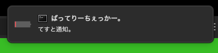
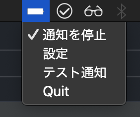

# ばってりーちぇっかー。(batterychecker)
## 説明
10%ごとに通知してくれるやつです。
 

 

 
通知を停止することもできます。

rumpsの通知がうまくいかなかったのでterminal-notifierを使用しています。

# Usage
`dist/ばってりーちぇっかー。.app` or [dropbox](https://www.dropbox.com/s/ausdzeqvorslg3d/%E3%81%B0%E3%81%A3%E3%81%A6%E3%82%8A%E3%83%BC%E3%81%A1%E3%81%87%E3%81%A3%E3%81%8B%E3%83%BC%E3%80%82.zip?dl=0)
open.

